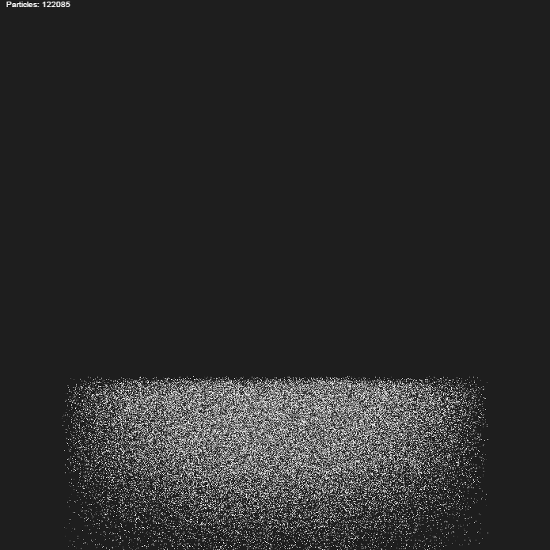

# Data Structures in the 21st Century

## Proposal Abstract

Processors are not what they used to be! Most programs are no longer CPU
limited, instead they are limited by memory access patterns and lack of
parallelization. But after years of indoctrination, we often write code as if
the old rules still applied, making our programs unnecessarily sluggish.

This talk will show how to write high-performance software in a "data-oriented"
way and get an order-of-magnitude (or more) of speed improvement. I will show
how certain data structures, such as lists, lead to bad cache behavior and
what you can use instead in order to get the same behavior but vastly improved
performance. I will also show how to organize your code on a higher level to
access the enormous computing power of modern multi-core CPUs and GPUs.

Most of my examples will be from C++, but the lessons learned apply across all
languages. I will show how even high-level languages, such as Lua or JavaScript
can get dramatic performance improvements by adapting data-oriented
methodologies.

## Intended Audience & Prerequisites

Anyone interested in writing high-performance software that gets the most
out of our modern multi-core CPUs and GPUs.

## Presentation Outline

* What is new about modern CPUs
	* Memory latency has not increased as fast as clock-speed
	* The importance of cache coherence
	* More cores!
* Implications for performance
* Data structures to avoid, and what you can do instead
	* std::list
	* std::deque
	* std::map
* SIMD processing and structure-of-arrays
* Making use of multi-core and GPUs
	* Data-flow vs object messaging
	* Thread pools and job systems
* Efficient memory allocation
* Data-oriented programming in JavaScript
* Conclusion: Rules of thumb for building high performance applications

## Additional Materials

Particle simulation in JavaScript. Running in web browser and simulating
122,085 individual particles:

