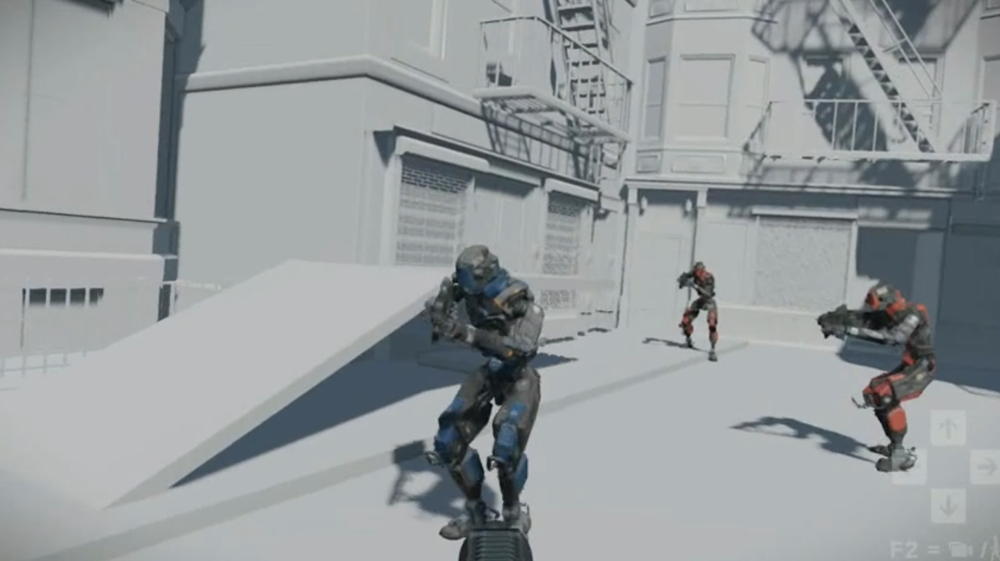
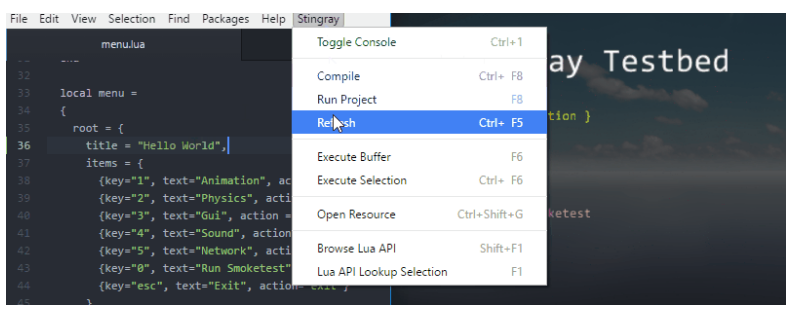
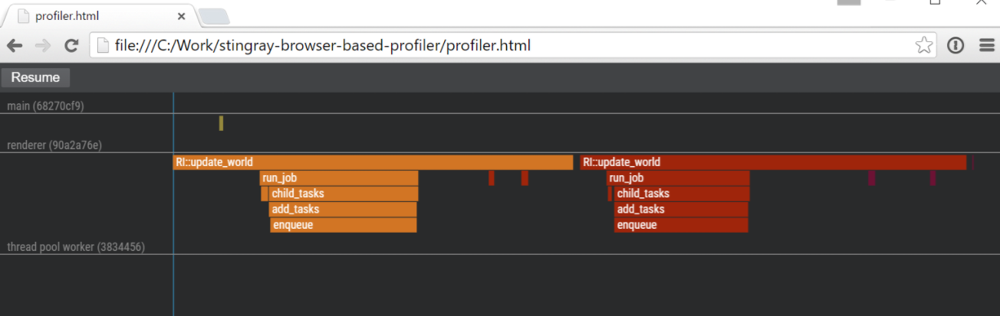

# Extensible Architecture -- Opening the Floodgates Without Ruining the Pond

## Proposal Abstract

The move towards "software as a platform" presents many interesting challenges.
As more and more people want to build stuff on top of your foundation, you will
struggle to preserve cohesion, quality and sanity.

This talk will present the solutions we use in the Stingray game engine to
allow other teams and end customers to extend the engine and build new products
on top of it. We will look at how things like scripting and use of open
standards facilitate sharing. We will also take a more in-depth look at the
Stingray plug-in system and how it has been designed to provide maximum
flexibility while protecting the Stingray core.

## Intended Audience & Prerequisites

Anyone interested in moving their software to a "platform" model and want to
enable openness, collaboration, sharing and hacking, while preserving the
important values of the core components.

## Presentation Outline

* The challenges of being a "platform"
	* The dangers of "opening the floodgates"
	* Us versus Them thinking
* Protecting core code values, while still allowing "hacking" and extensibility
	* Clean and minimalistic interaction interfaces
	* Front doors and back doors
* Stingray solutions for extensibility
	* Scripting
	* Open standards: JSON, Websockets
	* Entity/component architecture
	* The engine plugin system
* Thoughts and future plans for tools extensibility

## Additional Materials

Human IK runs as a Stingray plugin:

Use of open standards allows helper programs for Stingray to be written in
pure JavaScript, for example Stingray could be integrated into the Atom
text editor as a Hackathon project:

Or this Stingray profiling tool, running in a regular web browser:

