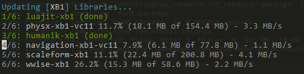
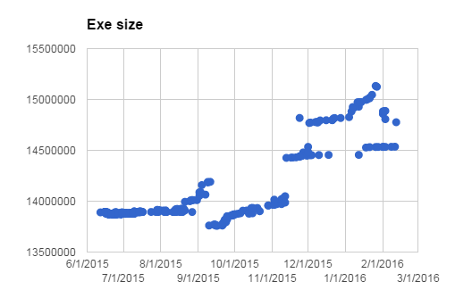
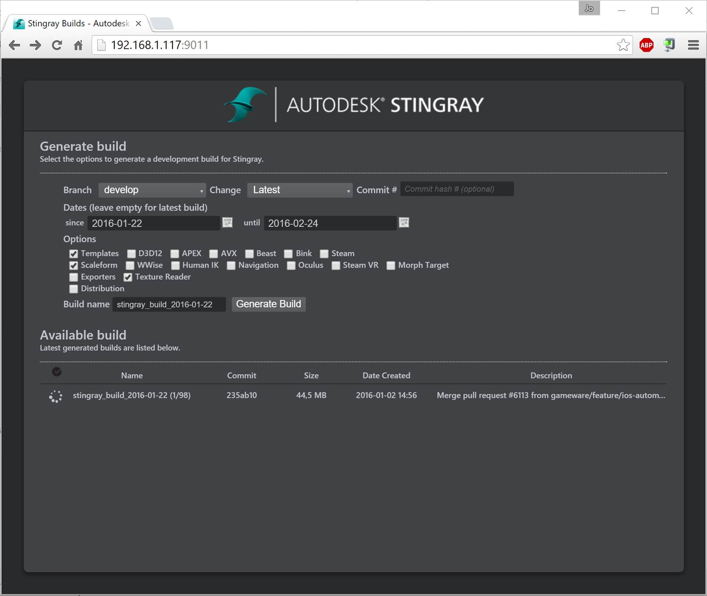

# The Stingray Package Manager and Build System

## Proposal Abstract

Having a one-button build system makes a project much more accessible to new
users, which facilitates openness and code sharing. In addition, it is great
for continuous integration and debugging. It also makes it easy to build
historic versions of the product, which enables powerful tools such as
`git bisect`

This talk will present the Stingray build system, and especially the Stingray
Package Manager (`spm`) which we use for downloading and installing third-party
libraries.

A package manager needs to be fast at downloading, resilient against error,
user friendly and not use too much disk space (some libraries are GB sized).
This talk will show how we solved these technical challenges and present a
final system that can be used by anybody who wants to manage building software
using third-party libraries.

## Intended Audience & Prerequisites

Anyone interested in creating a fast one-button build system that works well
with third-party libraries.

## Presentation Outline

* Overview of Stingray's build system (ruby + CMAKE + spm)
* Improving build performance
* The Stingray Package Manager (`spm`)
	* Requirements
	* Design
	* `spm` versus `git lfs`
	* "Secret" packages
	* Testing locally
	* From "decent" to "excellent" -- finishing touches
* Advantages of one-button builds
	* `git bisect`
	* Gathering performance statistics
* Challenges
	* Hard versioning SDKs and OSs
	* Bootstrapping -- installing Ruby
	* Commercial software installs

## Additional Materials

Stingray Package Manager running in the console:

We can gather historic data about the product by writing a script that
automatically builds the product at various points in its history and gathers
statistics about it:

Stingray online build request system:

