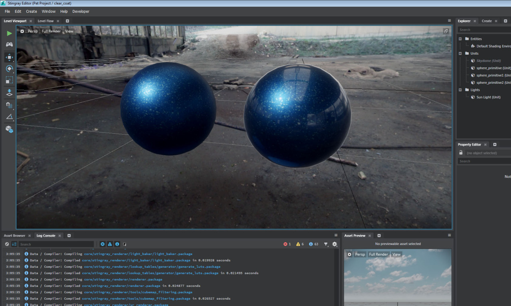

# Stingray 101

## Proposal Abstract

Autodesk has a game engine!

This talk will give a technical introduction to the Stingray game engine. I
will start by talking about what a game engine *is*, how the core components
work together and what special challenges games face, compared to other
software projects. I will also show how game technology can be used in
other domains, such as architectural visualization or in the film industry.

The second part of the talk will focus on what makes Stingray special,
compared to other game engines. I will discuss the core values that we agreed
on when we started to develop Stingray, why we thought those particular
values were important and how adherence to those values has translated to
unique features that are not available in any other game engines.

## Intended Audience & Prerequisites

This talk is intended for anyone who is interested in learning more about
game engine technology or are interested in using parts of the Stingray
technology for their own projects.

## Presentation Outline

* What is a game engine?
	* Game requirements: speed and flexibility
	* Gaming technology outside games
* How does Stingray work -- technical overview
	* Source data
	* Data compilation
	* The runtime loop
	* Scripting gameplay
* Stingray core values
	* Simplicity
	* Flexibility
	* Scalability
	* Quick iterations
* Stingray unique features
	* Mergable file formats
	* Collaborative editing
	* Reloadable game play
	* Extensibility
	* Flexible render pipe
	* Cross-platform drop/in-play

## Additional Materials

Stingray screenshots:

